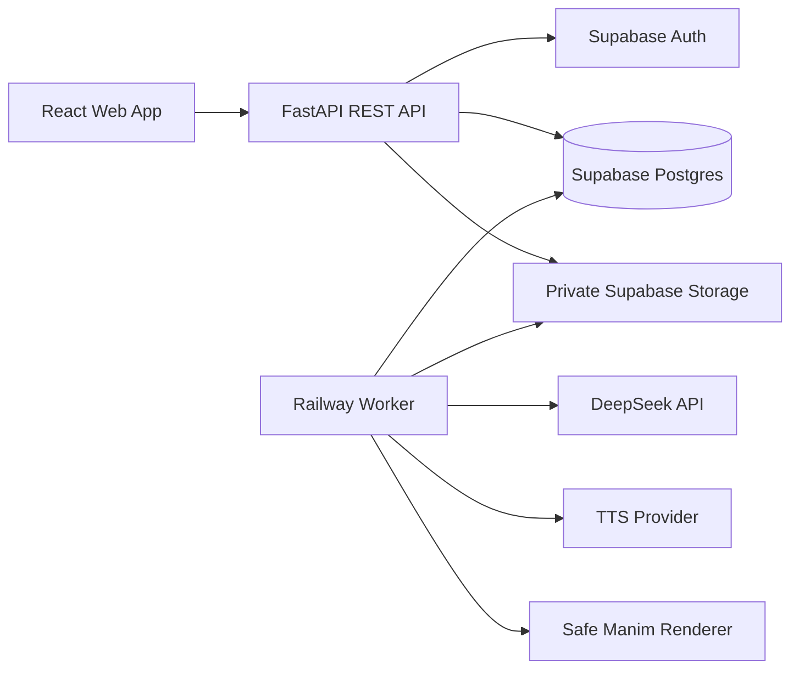
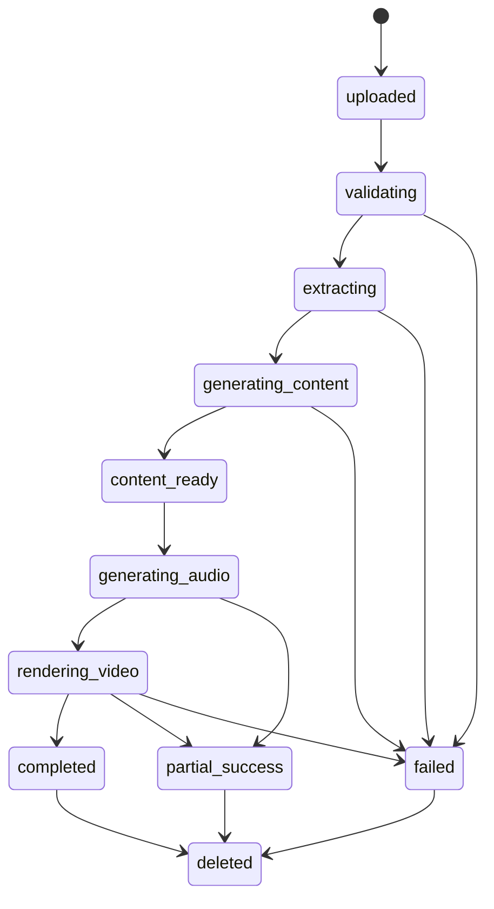

# Architecture

The API accepts uploads, validates files before quota consumption, creates durable database jobs, and returns status immediately. The worker leases jobs from Postgres, persists content before video rendering, and uploads private media objects. Clients poll status and request short-lived signed URLs only after backend authorization.
